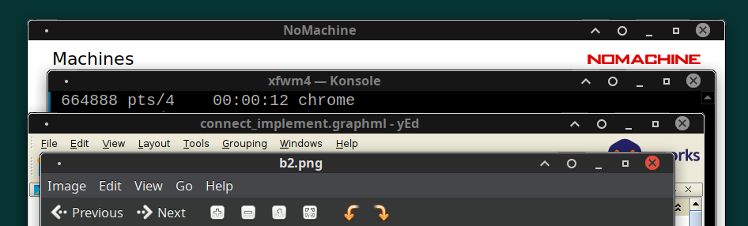

# Neophyte: Xfce/xfwm4 theme

This theme uses 1-pixel dark line and 1-pixel light line in window border to be
always able visually distinguish contents of windows in **both** dark and
light themes:

This theme is heavily inspired by and is based on
[Graphite theme](https://github.com/vinceliuice/Graphite-gtk-theme)
(its xfwm4 part).
